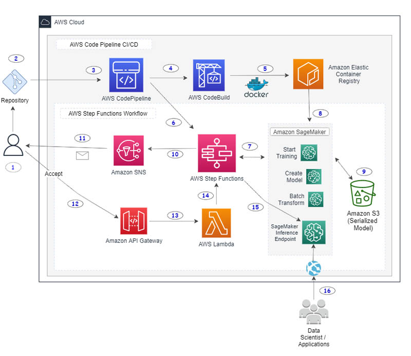

# Machine learning training model to recongnise Iris flower


##  Building through GitHub action
The project is broken down into two segements.

### 1. Building the Iris flower training application

The code loads a dataset of iris flowers, trains a Random Forest model, already created, and then uses that data to classify the species of the flowers based on their measurements. The trained model is then saved to a file 'model.joblib' for future use.

What has been achieved

Build pipeline
```markdown

Run test -------> Train model -------> Create docker image -------> store image in ECR -------> Package model (model.joblib) -------> Create model artifact
```

 deploy_to_s3
```markdown

Download model artifact -------> Upload compressed artifact to S3
```

deploy_to_sagemaker
```markdown

Download model artifact -------> Upload compressed artifact to S3
```

An alternative of this is using SageMaker comprehensively
```markdown

Sage Maker -------> END Point (API CALLS) -------> result [y/n]
    |
    |   <-------> S3 bucket (stored module)
    |
    v
ECR Image (Train, test, and revise module to S3)
```

S3 Bucket is used to store the trained model. The model is contineously trained by Sagemaker and updated in S3
ECR image contains the application aware of how to process the model will also include inferencing script aware of applying the model.


Further reading and reference:
- https://scikit-learn.org/stable/auto_examples/datasets/plot_iris_dataset.html
- https://scikit-learn.org/stable/modules/generated/sklearn.ensemble.RandomForestClassifier.html

### 2. Building the supporting infrastructure for inferencing

Machine learning inferencing is the ability to make use of the trained model. In our example, using Lambda, we aim to extract the trained model to predict whether a plant is an Iris Flower based in the flowers dimensions - petals.

The current method
```markdown

API Call -------> API Gateway -------> API Lambda (load model) -------> S3 bucket (stored module)
                     |                  |           |
                     |                  |           |
                     v                  v           |
                 cloudwatch        result [y/n]     |
                 monitoring &                       v
                 logging                        cloudwatch
                                            monitoring & logging
```

Alternative method
```markdown

Sage Maker -------> END Point (API CALLS) -------> result [y/n]
    |
    |   -------> S3 bucket (stored module)
    |
    v
ECR Image (Train, test, and revise module to S3)
```


references:
- Sagemaker inferencing: https://www.datacamp.com/tutorial/aws-sagemaker-tutorial
- Machine learning inference: https://www.datacamp.com/blog/what-is-machine-learning-inference
- Flask fir Sagemaker inference: https://towardsdatascience.com/deploy-a-machine-learning-model-using-flask-da580f84e60c

## Explaining an alternative CICD pipeline, with diagram, using AWS services, instead of GitHub. 

Alternative using native AWS CICD pipeline
```markdown

Developer Push code -------> CodeCommit -------> CodePipeline -------> CodeBuild -------> Store Image (ECR) -------> Sage Maker -------> Store model (S3)
                                                                         
```

- Developer push code: Develoer pushes code to CodeCommit
- CodeCommit: CodeCommit repository, alternative to GitHub repository
- CodePipeline: Detects changes in the repository and triggers the pipeline
- CodeBuild: Installs dependencies, runs the tests, and trains the model
- -  S3 Bucket: Store the trained model in AWS S3
- - Stores application image in ECR
- Builds SageMaker model, and endpoint


A more complete scanerio can be found in the following example:



The workflow includes the following steps:

1. The data scientist works on developing custom ML model code using their local notebook or a SageMaker notebook. They commit and push changes to a source code repository.
2. A webhook on the code repository triggers a CodePipeline build in the AWS Cloud.
3. CodePipeline downloads the source code and starts the build process.
4. CodeBuild downloads the necessary source files and starts running commands to build and tag a local Docker container image.
5. CodeBuild pushes the container image to Amazon ECR. The container image is tagged with a unique label derived from the repository commit hash.
6. CodePipeline invokes Step Functions and passes the container image URI and the unique container image tag as parameters to Step Functions.
7. Step Functions starts a workflow by initially calling the SageMaker training job and passing the necessary parameters.
8. SageMaker downloads the necessary container image and starts the training job. When the job is complete, Step Functions directs SageMaker to create a model and store the model in the S3 bucket.
9. Step Functions starts a SageMaker batch transform job on the test data provided in the S3 bucket.
10. When the batch transform job is complete, Step Functions sends an email to the user using Amazon Simple Notification Service (Amazon SNS). This email includes the details of the batch transform job and links to the test data prediction outcome stored in the S3 bucket. After sending the email, Step Function enters a manual wait phase.
11. The email sent by Amazon SNS has links to either accept or reject the test results. The recipient can manually look at the test data prediction outcomes in the S3 bucket. If they’re not satisfied with the results, they can reject the changes to cancel the Step Functions workflow.
12. If the recipient accepts the changes, an Amazon API Gateway endpoint invokes a Lambda function with an embedded token that references the waiting Step Functions step.
13. The Lambda function calls Step Functions to continue the workflow.
14. Step Functions resumes the workflow.
15. Step Functions creates a SageMaker endpoint config and a SageMaker inference endpoint.
16. When the workflow is successful, Step Functions sends an email with a link to the final SageMaker inference endpoint.


For more information: https://aws.amazon.com/blogs/machine-learning/build-a-ci-cd-pipeline-for-deploying-custom-machine-learning-models-using-aws-services/

## Consideration

Scaling:
- AWS Lambda, API Gateway and S3 all scale automatically as this is handled by AWS
- Structured data can use RDS, DynamoDB, Datawarehouse (large amount of data (extracted transformed loaded) designed for analytis/query)
- Unstructured/semi-structured data: DataLake (data from all sources and type dumped to be organised. Once organised stored in database or datawarehouse)
- loadtesting - AWS distributed load testing

Security:
- Least priveledge. All services requring only the necessary permissions.
- Encrypt transit and static data. Secret static resources should be ideally held in AWS secret manager.
- API Gateway: 
-  - authenticate users using OpenID, AWS cognito (app), or 0Auth.
-  - set up throttling to prevent DDoS attacks. 

Reliability:
- Use of serval availability zones (AZ) where possible
- Cross-regional resource sharing (CROS) where possible i.e. API Gateway and S3 buckets. The service replicas data across different regions in case of DR.
- Monitoring and logging: cloudwatch to monitor and log lambda functions, API gateway, and other AWS resources. Helps with checking health and performance of the services.
- Distastor Recovery: Backup and Versioning. 
-  - Versioning can be enabled in S3. This is helpful to track changes, and reverse course in case of DR or rollback.
-  - AWS Backup: Helps backup database servers, and other supported AWS services.

Error handling:
- AWS lambda will automatically retry 2 before failing. Transient error. Using SQS messaging queue, especially dead letter queues can help in troubleshooting and retrying failed requests at a later stage
- API Gateway allows for custom response based on client or server error helping developers and users.
- Caching is enabled by default to reducing load on lambda function and increasing the processses fault tolerance during high traffic.
- Step functions can be used for better flow control. It also helps preventing bottlenecks caused if a service e.g. lambda fails.
